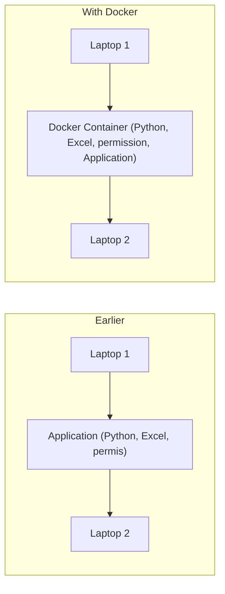
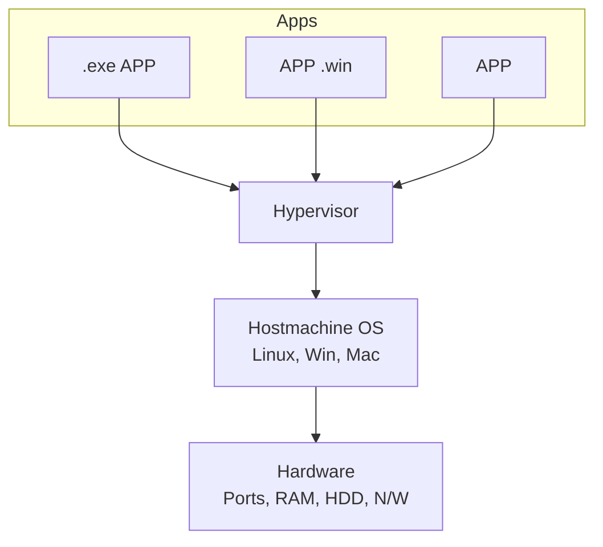
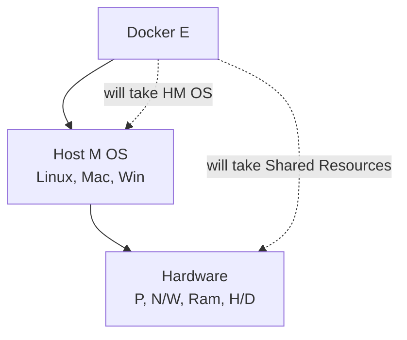

# Day 29
## Task 1

### 1. What is Docker?
Docker is a containerization tool that helps you build and run application without platform dependencies like different OS, permissions, blueprint etc. [cite: 1]

**Earlier vs. With Docker:**

*Notes (Earlier):* # It has Python V, # No SQL, # No permis. The Application will not work on Laptop 2 as it has not enough configurations. [cite: 1]

## Difference Between VM and Containers

### Virtual Machines (VM)
1. A Virtual Machine called as VM which requires full fledged guest operating system via hypervisor. [cite: 1]
2. It has a hardware level isolation, making them ideal for legacy environment where strong security boundaries are required. [cite: 1]
3. VM are extensive in resources as and take minute to Boot up as they require to Boot complete Operating System. [cite: 1]
4. VMs are used for runing different OS on same host, legacy application or workloads requiring strict OS-LEVEL control. [cite: 1]

**VM Architecture Diagram Representation:**

### Containers
1. Containers virtualize the OS and sharing the Kernal (host) and running only the Application and its dependencies. [cite: 1]
2. Containers offers process-level isolation via namespaces and Cgroups which is light security but relies on host kernal Security. [cite: 1]
3. Containers are lightweight (MB in size) and start in milliseconds because they skip the OS boot processes. [cite: 1]
4. Containers are used for microservices, CI CD Pipeline and cloud-native application where Rapid scaling and portability are critical. [cite: 1]

**Docker/Container Architecture Diagram Representation:**

# Q What is docker Architecture?

* It works on Client-Server-Model where the Docker Client sends commands to Docker Daemon via Rest API which manages the creations and lifecycle of Docker containers using Docker images and store from a Docker Registry

# Core Components

* **Docker Client** = It is used to Accept the commands which acts like a CLI and forwards them to daemon

* **Docker Daemon**
  It listens the API Request and manage Docker Object like API Request and manages Docker objects, including building images, Running container and handling network and storage

* **Docker Image**
  It is like read only templates having Application code, dependencies and configuration basically Blueprint for containers

* **Docker containers**
  Isolated instance of Docker images that executes application independently while sharing the host Kernal OS Kernal

* **Docker Registry**
  It is a like a Repository which is used to store, share Docker images, allowing client to push and pull images as needed

## Task 2 Installation

# Installing Docker

# Start and enable Docker

# Adding user and user group and verify Docker

# Running 1st container

* **What happened?? Reading the Output** 

The hello-world output perfectly explains the Docker architecture in action. When I ran that command:
1. The Client: The Docker CLI contacted the Docker daemon (the background engine).
2. The Local Check: The daemon checked locally for the hello-world image.
3. The Pull: Since I didn't have it locally, the daemon pulled (downloaded) it from the Docker Hub registry.
4. The Execution: The daemon created a new container from that image, which ran the executable that printed the "Hello from Docker!" message on my screen.

## Task 3 Run The Real Containers

# Run NGINX WEB SERVER

I navigated to http://3.139.106.112:8081 see the Nginx welcome page

# Listing all the containers including stopped

# Stopping and removing Container

## Task 4 Exploring Docker features 

# Run NGINX WEB SERVER In detached mode 

What is different? 
The -d flag runs the container in the background (detached). Instead of hijacking my terminal and showing live logs, it simply prints the container ID and gives me my terminal prompt back.

# Custom Naming and Port Mapping

* --name sid-server: Assigns a custom, readable name instead of a randomly generated one.
* -p 8080:80: Maps port 8080 on my physical host machine to port 80 inside the container.

# Check Container Logs

# Execute a Command Inside a Running Container

What this does: Unlike docker run which creates a new container, docker exec allows me to log into a container that is already running to troubleshoot or view files.

# Key Takeaways from Day 29:
1. Containers solve the "works on my machine" problem by packaging code and dependencies together.
2. Unlike VMs, containers share the host OS, making them extremely fast and resource-efficient.
3. The Docker CLI communicates with the Daemon, which pulls images from Docker Hub to build running containers.

