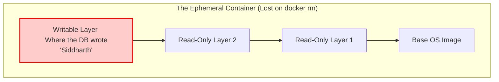
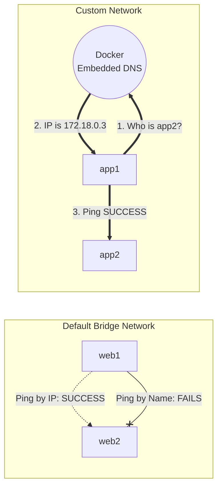
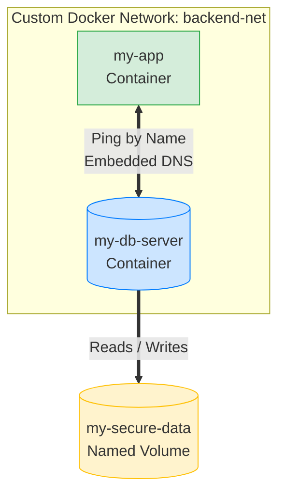

# 🚀 Day 32 – Docker Volumes & Networking

> **"Containers are ephemeral by design. Volumes make data permanent, and Networks make containers talk."**

---

# 📖 Overview

Today's objective is to solve the two biggest challenges of containerization: data persistence and container communication. By default, when a container is deleted, all its data is lost. Furthermore, containers cannot easily communicate with each other by name on the default network. Today, we fix both using Docker Volumes and Custom Docker Networks.

---

# 🎯 Learning Objectives

By the end of this lab, I will be able to:

* Understand the architecture of a container's writable layer and why data is lost.
* Create and manage Docker Named Volumes for high-performance, persistent data.
* Use Bind Mounts to link host machine folders to containers for local development.
* Architect Custom Docker Networks using embedded DNS for dynamic container discovery.

---

# 💔 Task 1 – The Problem (Ephemeral Data)

## Step 1 – Run a Database Container and Add Data

I started a PostgreSQL container and connected to it to add some dummy data.

### Commands

```bash
# Run a Postgres container
docker run -d --name my-db -e POSTGRES_PASSWORD=mysecretpassword postgres

# Access the database terminal
docker exec -it my-db psql -U postgres

# Inside the database shell, create a table and add data:
CREATE TABLE users (id INT, name VARCHAR(50));
INSERT INTO users VALUES (1, 'Siddharth');
\q

```

## Step 2 – Destroy and Recreate

```bash
# Stop and remove the container
docker stop my-db
docker rm my-db

# Run a brand new container with the same name
docker run -d --name my-db -e POSTGRES_PASSWORD=mysecretpassword postgres

# Check for the data
docker exec -it my-db psql -U postgres -c "SELECT * FROM users;"

```

### What Happened and Why? (Detailed Explanation)

**Output:** `relation "users" does not exist`.

**Why:** The data is completely gone. To understand why, you have to look at how Docker builds containers. A container is simply a stack of read-only image layers, topped with a temporary "writable layer." When you execute `docker rm`, Docker completely obliterates this writable layer.

### 📊 Container Layer Architecture




---

# 💾 Task 2 – Named Volumes

To fix the data loss issue, we use **Named Volumes**. These are dedicated storage spaces managed entirely by Docker, effectively bypassing the container's temporary file system.

## Step 1 – Create and Attach a Volume

### Commands

```bash
# Create a named volume
docker volume create pg-data

# Run a Postgres container, attaching the volume to the DB path
docker run -d --name db1 -v my-db-data:/var/lib/postgresql -e POSTGRES_PASSWORD=mysecretpassword postgres

# Add data to the database
docker exec -it db1 psql -U postgres -c "CREATE TABLE users (name VARCHAR(50)); INSERT INTO users VALUES ('Persistent User');"

```

## Step 2 – Destroy and Verify Persistence

```bash
# Stop and remove the first container
docker stop db1
docker rm db1

# Run a NEW container, attaching the SAME volume
docker run -d --name db2 -v my-db-data:/var/lib/postgresql -e POSTGRES_PASSWORD=mysecretpassword postgres

# Verify the data!
docker exec -it db2 psql -U postgres -c "SELECT * FROM users;"

```

### Observation & Detailed Explanation

The data successfully survived! Because this storage area exists completely outside of the container's Union File System, deleting the container has zero impact on the volume.

### Volume Management Commands

```bash
docker volume ls
docker volume inspect db-data

```


---

# 🔗 Task 3 – Bind Mounts

Bind mounts map a highly specific, absolute path from your host computer directly into the container.

## Step 1 – Create Host Folder and File

```bash
mkdir my-website
cd my-website
echo "<h1>Original Host File</h1>" > index.html

```

## Step 2 – Run Nginx with a Bind Mount

```bash
# Map the current working directory $(pwd) to the Nginx HTML folder
docker run -d --name nginx-bind -p 8080:80 -v $(pwd):/usr/share/nginx/html nginx

```

*(Verified by visiting `http://localhost:8080`)*

## Screenshots


## Step 3 – Live Edit

```bash
# Edit the file directly on the host machine
echo '<h1>Updated dynamically from the Host!</h1>' > index.html

```

*(Refreshed the browser and the text updated instantly without restarting the container!)*


### Deep Dive: Named Volumes vs. Bind Mounts

```text
+-------------------------------------------------------------------+
|                        YOUR HOST MACHINE                          |
|                                                                   |
|   [Host File System]                  [Docker Managed Storage]    |
|   /Users/siddharth/my-website/         /var/lib/docker/volumes/   |
|           |                                      |                |
|       BIND MOUNT                            NAMED VOLUME          |
|    (Great for Code)                      (Great for Databases)    |
|           |                                      |                |
|           v                                      v                |
|   +-----------------+                  +-----------------+        |
|   | Container A     |                  | Container B     |        |
|   | /usr/share/html |                  | /var/lib/pgdata |        |
|   +-----------------+                  +-----------------+        |
+-------------------------------------------------------------------+

```
### 📦 1. Named Volumes (The "Hands-Off" Approach)

Think of a Named Volume as a **safe deposit box managed by Docker**. You tell Docker, *"I need a box named `db-data`,"* and Docker figures out exactly where to put it on your hard drive.

* **How it works:** You give the volume a name (e.g., `docker volume create my-data`), and Docker securely stores it in its own hidden directory (usually `/var/lib/docker/volumes/` on Linux).
* **What it is best for:** **Databases and Production Data.** Because Docker fully controls this area, it is incredibly fast and completely isolated from the rest of your operating system.
* **The Big Advantage:** It is 100% portable. If you share your `docker-compose.yml` file with a friend on Windows, a colleague on Mac, and a production server on Linux, a Named Volume will work perfectly on all three because Docker abstracts the underlying OS file paths.

**Example Command:**

```bash
docker run -v my-db-volume:/var/lib/postgresql/data postgres

```

---

### 🔗 2. Bind Mounts (The "Hands-On" Approach)

Think of a Bind Mount as a **wormhole connecting a specific folder on your laptop directly into the container**.

* **How it works:** You give Docker an *exact, absolute path* on your host machine (e.g., `/Users/siddharth/my-website/src`) and tell it to overwrite a folder inside the container with those contents.
* **What it is best for:** **Local Development.** If you bind mount your source code into a container, you can open VS Code on your laptop, edit a Python or HTML file, hit "Save", and the application inside the container updates instantly without needing a rebuild.
* **The Big Disadvantage:** It is fragile. If you write a command using `/Users/siddharth/code` and send it to your coworker who uses Windows (`C:\Users\John\code`), the container will crash because that path does not exist on their machine. It can also cause file permission errors (e.g., your laptop user vs. the container's `root` user fighting over who owns a file).

**Example Command:**

```bash
docker run -v /Users/siddharth/my-website:/usr/share/nginx/html nginx

```

---

### ⚖️ The Ultimate Comparison Cheat Sheet

| Feature | Named Volumes | Bind Mounts |
| --- | --- | --- |
| **Who manages it?** | Docker Engine | You (The Host OS) |
| **Where does it live?** | Hidden in Docker's internal system folder | Anywhere you choose on your laptop |
| **Primary Use Case** | Databases, Production deployments | Local development, Hot-reloading code |
| **Portability** | Excellent (Works across Mac/Win/Linux) | Poor (Tied to specific host file paths) |
| **Performance** | Extremely Fast | Can be slow on Mac/Windows (due to OS translation) |
| **Ease of Backup** | Docker provides built-in CLI commands | Managed manually via normal OS copy/paste |

**The Golden Rule:** Use **Bind Mounts** when *you* need to edit the files (like writing code). Use **Named Volumes** when the *application* needs to edit the files (like a database saving user records).


---

# 🌐 Task 4 – Docker Networking Basics

## Step 1 – Inspect Default Networks

```bash
# List all networks
docker network ls

# Inspect the default bridge
docker network inspect bridge

```

## Step 2 – Test Communication on Default Bridge

```bash
docker run -d --name web1 nginx
docker run -d --name web2 nginx

# Find IP of web2
docker inspect -f '{{range.NetworkSettings.Networks}}{{.IPAddress}}{{end}}' web2

# Test ping by IP (This works!)
docker exec web1 ping -c 2 <IP_OF_WEB2>

# Test ping by Name (This fails!)
docker exec web1 ping -c 2 web2

```

### Observation

On the default `bridge` network, containers can ping each other using their IP addresses, but they **cannot** resolve each other by container name.


---

# 🕸️ Task 5 – Custom Networks

## Step 1 – Create and Test a Custom Network

```bash
# Create a custom bridge network
docker network create my-app-net

# Run containers ON the custom network
docker run -d --name app1 --network my-app-net alpine sleep 3600
docker run -d --name app2 --network my-app-net alpine sleep 3600

# Ping by NAME
docker exec app1 ping -c 2 app2

```

### Why Custom Networks Fix the Problem

When you create a custom network, Docker activates an **embedded DNS server**. It intercepts the ping for "app2", looks up app2's IP address, and connects them automatically.

### 📡 Network Resolution Flow




---

# 🧩 Task 6 – Put It Together

The ultimate goal: Architecting a secure network where a backend application can dynamically discover and talk to a persistent database.

## Execution

```bash
# 1. Create the secure backend network
docker network create backend-net

# 2. Start the Database with a Named Volume ON the custom network
docker run -d --name my-db-server \
  --network backend-net \
  -v my-secure-data:/var/lib/postgresql/data \
  -e POSTGRES_PASSWORD=admin \
  postgres

# 3. Start an App container ON the same network
docker run -d --name my-app \
  --network backend-net \
  alpine sleep 3600

# 4. Verify the App can communicate with the Database securely by Name!
docker exec my-app ping -c 3 my-db-server

```

### 🏗️ Final Architecture Diagram



📸 `[Insert Screenshot of my-app successfully pinging my-db-server]`

---

# 🌟 Key Takeaways

* Never rely on a container's writable layer for data you care about. When the container dies, the data dies.
* Use **Named Volumes** for persistent application data to ensure high performance and safe storage decoupling.
* Use **Bind Mounts** exclusively for local development to enable hot-reloading of source code.
* Relying on default Docker bridge IP addresses is an anti-pattern.
* Always create **Custom Networks** for multi-container applications to leverage Docker's embedded DNS server, ensuring seamless, name-based container discovery.

```

```
